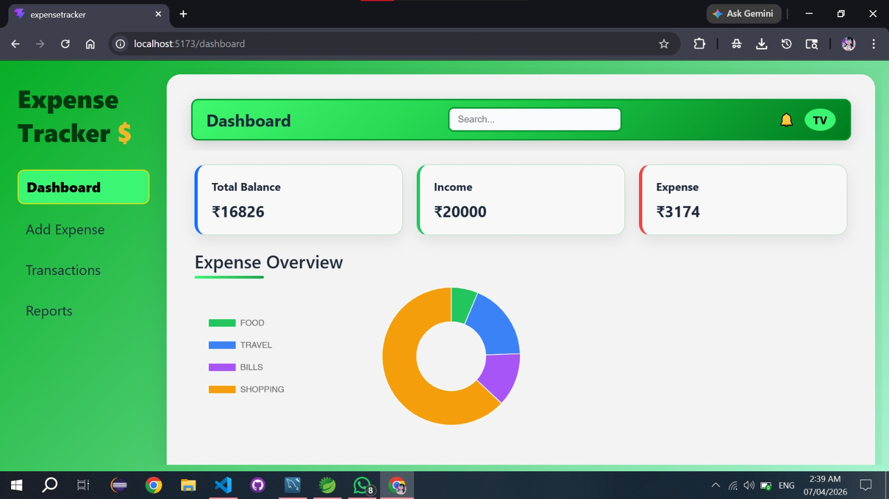
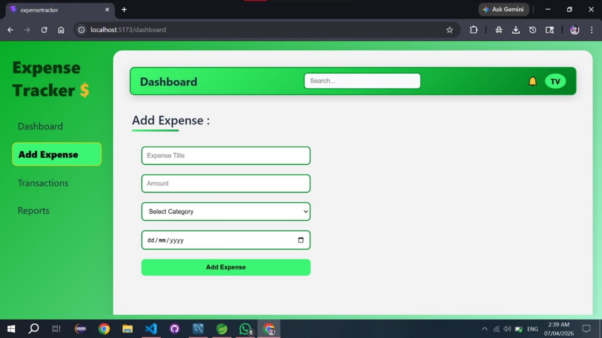
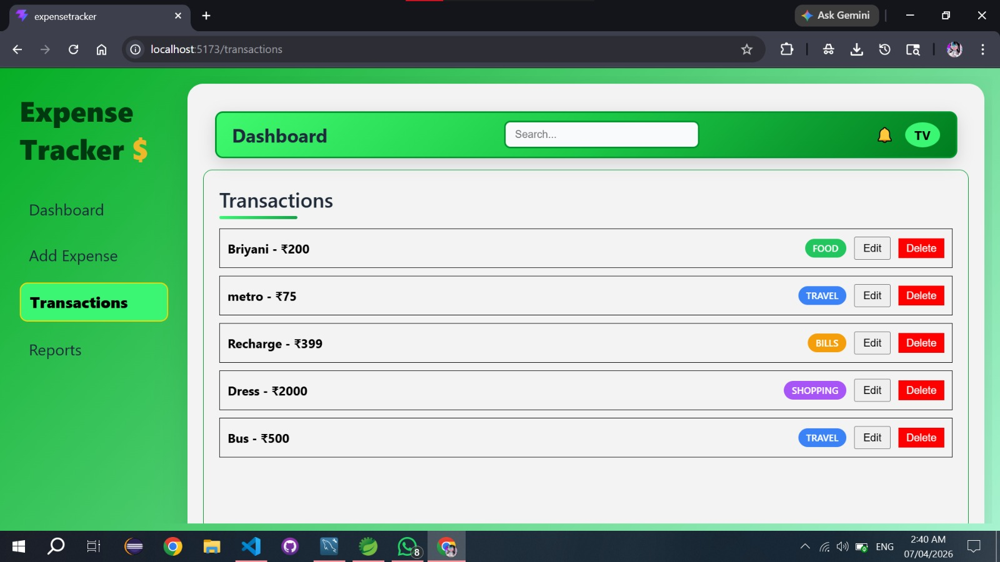
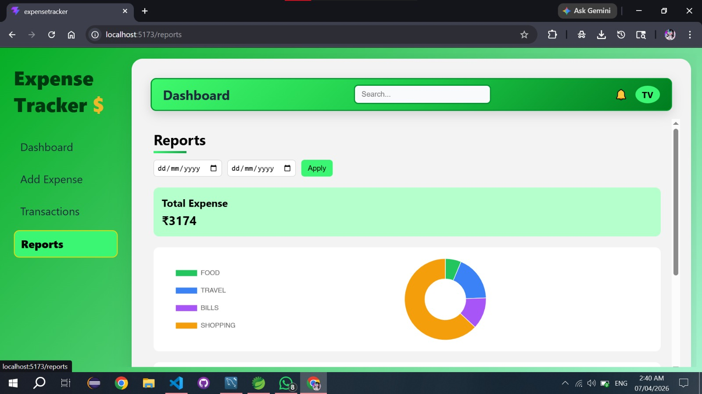

# Expense Tracker Full Stack App

## 🚀 Tech Stack
- Frontend: React.js, HTML, CSS, JavaScript
- Backend: Spring Boot (Java, OOPS)
- Database: MySQL

## ✨ Features
- Add / Edit / Delete Expenses
- Category tracking
- Dashboard with charts
- Reports with filtering

## 🔗 Architecture
React → Spring Boot → MySQL

## 📸 Screenshots

### Dashboard

### Add Expense

### Transactions

### Reports
